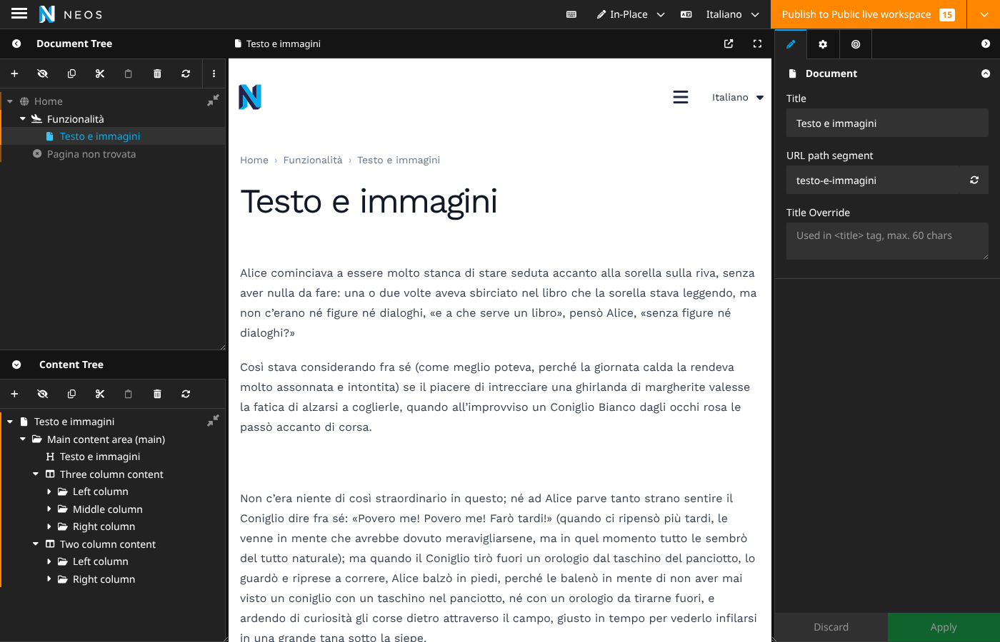

# Supertext Translation for Neos

Translates pages and content with **Supertext AI** the moment an editor creates them in another language in Neos — via the language menu's *Create and copy* (or *Create empty*) dialog, or the `supertext:translate` command. No new workflow: editors keep using Neos' own content dimensions.

Works with Neos 9.0+ (tested on 9.1), PHP 8.2+.



## How it works

1. The editor switches the language menu to a language the page doesn't exist in yet and chooses *Create and copy*. Neos creates the page and its content in that language.
2. A content repository command hook notices these new language variants and collects them.
3. After the request, all their text goes to Supertext as **one HTML document per target language**, so a page with twenty content elements is a single API round trip.
4. The translations are written back as normal edits in the editor's workspace (history and permissions included), the page's URL segment is rebuilt from the translated title, and the editor reviews and publishes as usual.

If Supertext fails, the pages are still created, as untranslated copies, and the reason is logged.

Which fields are translated is derived from the node types: inline-editable texts (formatting kept) and Inspector text, text area and rich text fields. Override per property with `options.supertext.translate`.

## Documentation

| Guide | For |
| --- | --- |
| [Installation guide](docs/INSTALLATION.md) | Administrators: requirements, install, API key, languages, settings, troubleshooting |
| [User guide](docs/USER_GUIDE.md) | Editors: translating, reviewing, publishing, what gets translated |
| [Developer guide](docs/DEVELOPER.md) | Architecture, API protocol, local setup, tests, screenshots, demo deployment |

Quick start (not on Packagist yet — add the GitHub repository first, see the installation guide):

```bash
composer require supertext/neos-translation
export SUPERTEXT_API_KEY=...        # or Supertext.NeosTranslation.apiKey
./flow supertext:check
```

## Demo

`demo/` builds a container with Neos 9.1, the Neos demo site (English, German) plus empty French and Italian, and this package. It's deployed to Railway on every push to `main` — details in the [developer guide](docs/DEVELOPER.md#demo-railway).

## Roadmap

See the [developer guide](docs/DEVELOPER.md#known-limitations--roadmap) and [CHANGELOG](CHANGELOG.md).

## License

GPL-3.0-or-later
