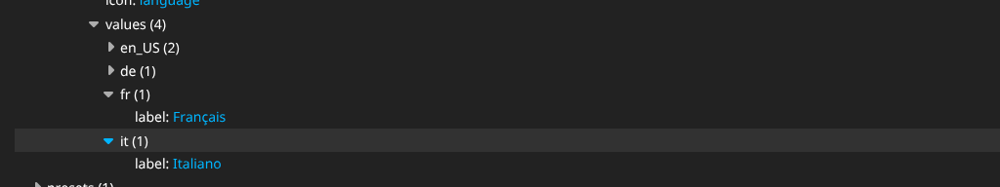
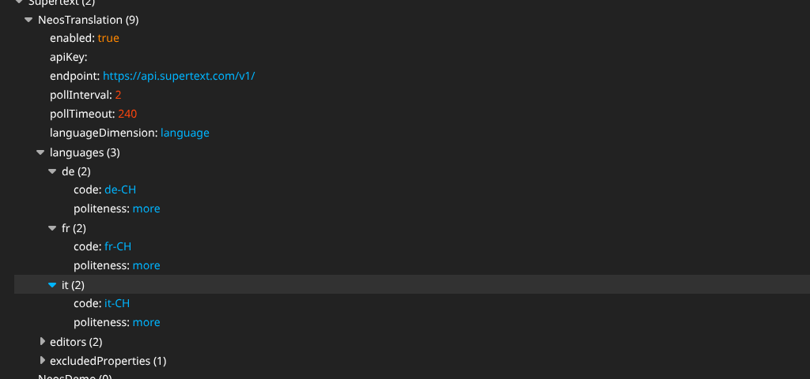

# Installation guide — Supertext Translation for Neos

For administrators setting up the package on a Neos site.

> **Just want to try it?** `demo/` contains a ready-to-run container with Neos 9.1, the Neos demo site in English and German plus empty French and Italian, and this package installed. It also runs the public Supertext demo. See the *Demo* section of the [developer guide](DEVELOPER.md#demo-railway).

## Requirements

| | |
| --- | --- |
| Neos | 9.0 or newer (developed and tested on 9.1) |
| PHP | 8.2 or newer, with `ext-dom` |
| Content dimensions | A language dimension (named `language` by default) |
| Supertext | An account ([create one or log in](https://www.supertext.com/person/en/account/signin)) with an API key ([supertext.com → Integrations → API](https://www.supertext.com/en/integrations/api), requires the Admin role) |
| Network | The web server must reach `https://api.supertext.com` over HTTPS |

## 1. Add the package

The package is not on Packagist yet. Add the GitHub repository to your project's `composer.json`, then require it:

```bash
composer config repositories.supertext-neos vcs https://github.com/Supertext/Neos-Supertext-Translation
composer require supertext/neos-translation:dev-main
./flow flow:cache:flush
```

If the repository is private, Composer needs a GitHub token with read access (`composer config --global github-oauth.github.com <token>`).

Nothing to activate: the package registers itself (a content repository command hook and an HTTP middleware) for every content repository based on Neos' `default` preset.

## 2. Set the API key

Get the key first:

1. **No Supertext account yet?** [Create one at supertext.com](https://www.supertext.com/person/en/account/signin) (the same page logs you in if you already have one).
2. **Generate your API key** at [supertext.com → Integrations → API](https://www.supertext.com/en/integrations/api). This requires the **Admin** role in your Supertext account; ask your account admin otherwise.

Then set it, either:

- **Environment variable (recommended):** `SUPERTEXT_API_KEY=...` for the web server and CLI. It wins over the setting and keeps the key out of the repository.
- **Setting:** in your site package or `Configuration/Settings.yaml`:

  ```yaml
  Supertext:
    NeosTranslation:
      apiKey: '...'
  ```

Supertext shows the key as `Supertext-Auth-Key <key>`; you can paste it with or without that prefix.

Check it:

```bash
./flow supertext:check
```

## 3. Languages

The package translates whenever a page or content element is created in another value of the **language dimension** — no further setup needed. It sends the dimension value as the target language (`de` → `de`, `en_US` → `en-US`). To choose regional codes or the formality, map the dimension values:

```yaml
Supertext:
  NeosTranslation:
    languages:
      de:
        code: 'de-CH'        # target language code sent to Supertext
        politeness: 'more'   # more = formal (Sie/vous/Lei), less = informal (du/tu/tu)
      fr:
        code: 'fr-CH'
        politeness: 'more'
      en_UK:
        enabled: false       # never translate into this language
```

Regional variants of the same language (e.g. `en_US` → `en_UK`) are never translated.

The languages themselves are Neos content dimensions (`Neos.ContentRepositoryRegistry.contentRepositories.<id>.contentDimensions.language`). If you **add a language to a site that already has content**, extend the root node to it once, or Neos can't create pages in it ("Root Node Aggregates cannot be varied"). The demo does this with a node migration (`demo/DistributionPackages/Supertext.NeosDemo/Migrations/ContentRepository/`) and `./flow nodemigration:execute <version>`.

You can check the active configuration in the backend under **Administration › Configuration › Settings**, for the languages:



and for this package:



## 4. Check it works

Open a page in the backend, switch the language menu to a language the page doesn't exist in yet, and choose **Create and copy** — the page appears translated after a few seconds (see the [user guide](USER_GUIDE.md)). Or from the CLI:

```bash
./flow supertext:translate --node <page node id> --language fr --workspace user-<yourname>
```

## All settings

All under `Supertext.NeosTranslation`:

| Setting | Default | |
| --- | --- | --- |
| `enabled` | `true` | Translate automatically when nodes are created in another language |
| `apiKey` | `''` | API key; `SUPERTEXT_API_KEY` wins |
| `endpoint` | `https://api.supertext.com/v1/` | API base URL; `SUPERTEXT_API_ENDPOINT` wins |
| `pollInterval` | `2` | Seconds between status checks |
| `pollTimeout` | `240` | Maximum seconds to wait for one document |
| `languageDimension` | `language` | Name of the language dimension |
| `languages.<value>.code` | dimension value with `-` | Target code sent to Supertext |
| `languages.<value>.politeness` | `default` | `more` (formal), `less` (informal) or `default` |
| `languages.<value>.enabled` | `true` | `false` never translates into that language |
| `editors.plainText` | TextField, TextArea editors | Inspector editors whose string properties are translated as plain text |
| `editors.richText` | RichTextEditor | Inspector editors whose properties are translated as HTML |
| `excludedProperties` | `[uriPathSegment]` | Never translated (the URL segment is rebuilt from the translated title) |

**Per property** (in a NodeTypes YAML file) you can force a property in or out:

```yaml
'Vendor.Site:Content.Teaser':
  properties:
    internalNote:
      options:
        supertext:
          translate: false
    tagline:   # e.g. a string with a custom editor
      options:
        supertext:
          translate: true
```

Which properties are translated by default: `string` properties that are inline-editable (translated as HTML, formatting kept) or edited in the Inspector with a text, text area or rich text editor. Select boxes, link editors, images, references, dates and numbers are left alone.

## Updating

```bash
composer update supertext/neos-translation
./flow flow:cache:flush
```

## Uninstalling

```bash
composer remove supertext/neos-translation
./flow flow:cache:flush
```

Translations already made stay in place; they are ordinary Neos content.

## Troubleshooting

| Symptom | Cause / fix |
| --- | --- |
| New language pages stay in the source language | Look in `Data/Logs/System.log` (`System_Development.log` in Development context) for lines starting with `Supertext:`. The HTTP response of the "create" request also carries an `X-Supertext-Error` header. |
| `No Supertext API key configured` | Set `SUPERTEXT_API_KEY` for the web server (e.g. Apache `SetEnv`, container variables) and the CLI, or the `apiKey` setting. No key yet: see *2. Set the API key*. `./flow supertext:check` tests it. |
| `Authentication failed` | Wrong or revoked key. Generate a new one at [supertext.com → Integrations → API](https://www.supertext.com/en/integrations/api) (Admin role) and paste it again; the `Supertext-Auth-Key ` prefix is optional. |
| `Too many requests` | Supertext's per-second limit; the package retries automatically (up to 4 times). Try again shortly if it persists. |
| `Timed out waiting for the Supertext translation` | Very long pages; raise `pollTimeout` (and PHP's `max_execution_time` / proxy timeouts accordingly). |
| "Root Node Aggregates cannot be varied" when creating a page in a new language | The language was added after the content was imported. Extend the root node to it (see *Languages*). |
| A field isn't translated | Check its property type and editor (see *All settings*), or force it with `options.supertext.translate: true`. |

## Security note

The API key is only read from the environment or the settings and is sent only to the configured endpoint. Translation runs with the permissions of the editor who created the page in the new language; the CLI command runs without authorization checks, like other Neos CLI commands.
