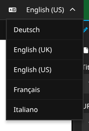
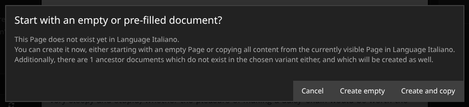
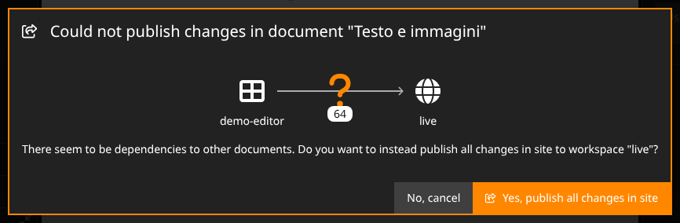
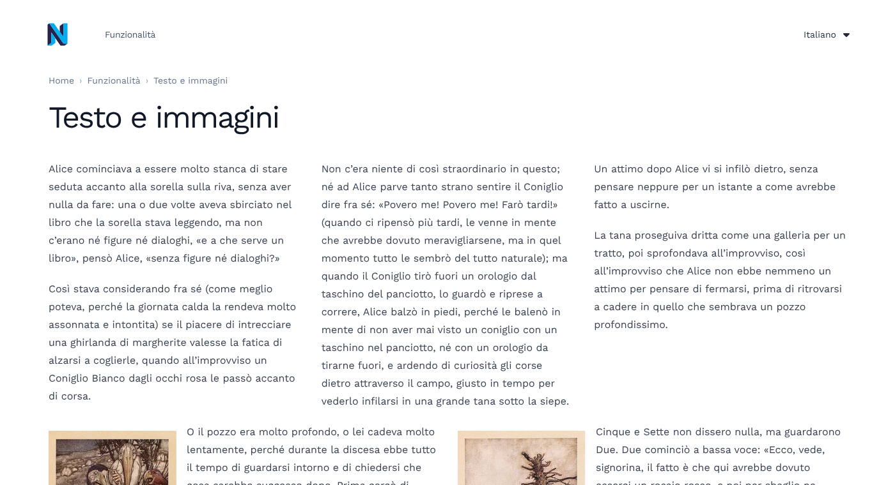

# User guide — Supertext Translation for Neos

For editors. Once an administrator has installed the package (see [INSTALLATION.md](INSTALLATION.md)), you translate pages exactly as you always do in Neos: switch the language and create the page. Supertext fills in the text.

## Translate a page

1. In the Neos backend, select the page in the **Document Tree**.
2. Open the **language menu** in the top bar and choose the target language.

   

3. If the page doesn't exist in that language yet, Neos asks how to start:

   

   - **Create and copy** — creates the page with all its content and translates everything: page title, headlines, text, image captions and so on. This is what you usually want.
   - **Create empty** — creates the page without content. Only the page's own fields (title, SEO texts) are translated.

   If parent pages are missing in that language too, Neos creates them as well, and they are translated in the same go.

4. Wait a moment. The whole page goes to Supertext as one request, typically a few seconds, longer for very long pages. Neos then shows the page in the new language, already translated:

   

## Review and publish

The translation lands in **your own workspace**, like any other change: visitors don't see it until you publish. Read through it, correct anything you like directly on the page, then publish:

The first time you translate into a language, Neos also created the parent pages (e.g. *Home*) in that language. Publishing only the current page then isn't possible, and Neos offers to publish all your changes instead. Choose **Yes, publish all changes in site** (and confirm), or review the other pages first.

After publishing, the page is live in the new language:

## What gets translated

- Everything you can edit directly on the page (headlines, text, rich text), with its formatting and links kept.
- Text fields in the Inspector: page title, SEO title and description, image alt texts and titles, and similar.
- The page's **URL path segment** is rebuilt from the translated title (e.g. *Testo e immagini* → `testo-e-immagini`).
- Pages translated as a whole: content elements inside columns and other containers are included.

## What is *not* translated

- Content you add to the source page **after** the page was translated. Add it in the target language yourself.
- Changes to the source page after translating. The translation is a one-time copy; it doesn't follow later edits.
- Images and files themselves, links' targets, dates, numbers, selections (e.g. alignment or heading level), and code/HTML elements.
- Regional variants of the same language, such as *English (UK)* from *English (US)*: Neos copies them as they are.

## Formal and informal language

Your administrator decides per language whether Supertext writes formally (*Sie*, *vous*, *Lei*) or informally (*du*, *tu*). On the Supertext demo, German, French and Italian are formal.

## When something goes wrong

If Supertext can't translate (for example no API key configured, network problem, quota exceeded), Neos still creates the page and its content in the new language, **as untranslated copies** in the source language. You can translate them by hand, or discard the changes in your workspace and try again later. Your administrator finds the reason in the Neos system log (see the installation guide).

The package has no screens of its own: everything you see while translating is Neos' own interface, in the interface language set in your user settings.

## Tips

- Translate a page at once with *Create and copy* rather than element by element: it's one request to Supertext, and the context makes the translation more consistent.
- Start at the top: translate the home page first, then its subpages. Each page then only creates itself in the new language.
